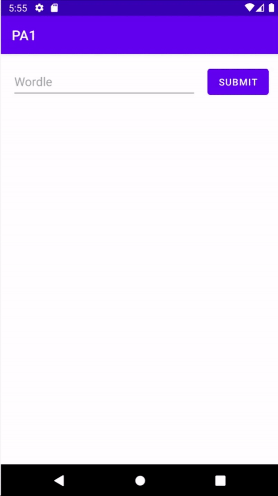

# Android_app

## Project 1 - Wordle application

### Guess five-letters English word (https://www.nytimes.com/games/wordle/index.html)
- User can only guess with a valid word
- Guess list must be shown
- Gray/Yellow/Green letter list must be shown

### Functionalities
#### Wordle
- On app exectution, generate a random answer
- Among given five-letters words dictionary

#### Guess
- If user type word, and press SUBMIT button, 
- Check if it is in the dictionary 
  - if not show toast : "Word '<User_input>' not in dictionary"
  - if in, add that guess to below lists and clear EditText
    
#### Wordle Word / Letter list
- Once user guessed the word in dictionary, it must be added and all the guessed five letters must be checked.
- The guessed five letters word is shown in one line.
- Newly added word must go to the bottommost.
- Set the text to guessed word's letter.

## Demo

