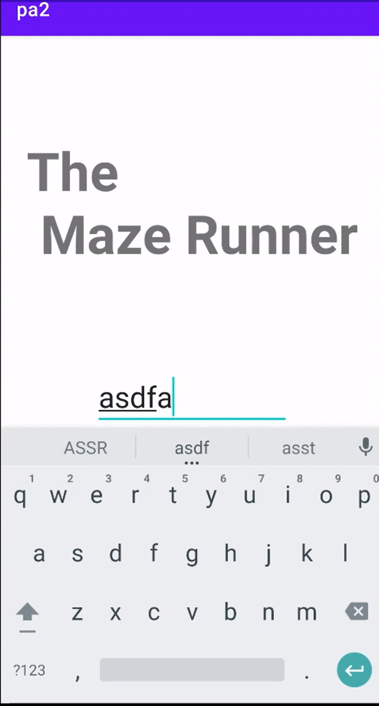

# Android app

## Project 1 - Wordle application

### Guess five-letters English word (https://www.nytimes.com/games/wordle/index.html)
- User can only guess with a valid word
- Guess list must be shown
- Gray/Yellow/Green letter list must be shown

### Functionalities
#### Wordle
- On app exectution, generate a random answer
- Among given five-letters words dictionary

#### Guess
- If user type word, and press SUBMIT button, 
- Check if it is in the dictionary 
  - if not show toast : "Word '<User_input>' not in dictionary"
  - if in, add that guess to below lists and clear EditText
    
#### Wordle Word / Letter list
- Once user guessed the word in dictionary, it must be added and all the guessed five letters must be checked.
- The guessed five letters word is shown in one line.
- Newly added word must go to the bottommost.
- Set the text to guessed word's letter.

### Demo

  

## Project 2 - The Maze Runner

### Escape the maze using Arrow keys

#### Sign in Activity
- This activity check input user name is valid or not using networking with server.

#### Maze Selection Activity
- This activity show the possible maze list
- At the start of activity, send GET request to server to get list of mazes

#### Maze Activity
- This activity show the selected square maze
- If user click (up, down, left, right) button, user character will move each direction.
- After move, user character must look in the move direction.
- User character can't pass through the wall.

---

#### Turn
- For every movement, increase the number(turn)
- Don't increase turn number if the character can't move because of the wall

#### Hint
- If you click hint button, calculate the shortest path to goal point, and make a dot at the next position in the path.
- When you pass that position the red dot disappears.
- Hint button works only 1 time at each challenge.

#### Arrival
- If character arrives at goal position, show toast message, shortly "Finish"

### Demo

  

## Project 3 - Harry Potter Shooter game

